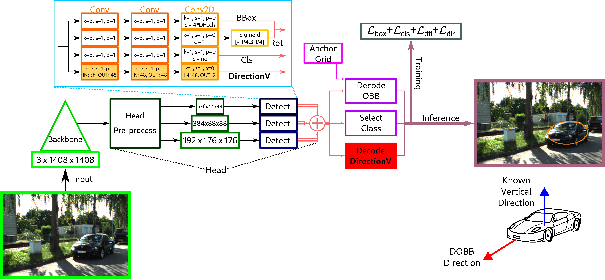

# Object-Based Camera Pose Estimation from a Single Object Detection and Gravity Vector

In this repo, we provide the code for DOBB method. The DOBB code is mainly based on [Ultralytics YOLOV8.1.24](https://github.com/ultralytics/ultralytics), please also cite their work if you are interested in our work. We will present a short description about how to train, evaluate, and run inference with DOBB. We also present a few addtional scripts used for data processing, e.g., creating the dataset and image rectification. The pretrained models are also available. Feel free to open an issue. Most pre- and postprocessing steps are or will be added to this repository.

## Abstract

Recent results on pose estimation from ellipsoid-ellipse correspondences, which can be readily obtained from an object detector, allow a direct computation of the camera pose from object-level correspondences. Unfortunately, standard bounding boxes (either horizontal or minimal enclosing boxes) are symmetric, which introduces an inherent ambiguity in the correspondence, yielding multiple or even infinite solutions. Furthermore, the current state of the art requires minimum two such correspondences to provide sufficient constraints for camera rotation. Our contributions make object-based pose estimation efficient in practice: First, a novel object detection method is proposed, called Directional Object Bounding Box (DOBB), which is capable of detecting the object’s own direction together with its minimal enclosing box (OBB), yet independently from it, which not only breaks the symmetry of OBBs, but also provides the necessary additional geometric information for our pose estimation method. Second, a novel object-based robust camera pose estimation pipeline is proposed where a minimal solution can be obtained from a single object for outlier filtering when vertical direction and the object orientation w.r.t. that axis are known; followed by a closed-form least squares solution for multiple inlier objects to compute the camera pose. Comparative tests confirm the state-of-the-art performance of the proposed DOBB-based pose estimation method on the standard KITTI360 and 7-Scenes datasets.

<p align="center">
   <br>
</p>

## Datasets

We provide 2 datasets, formatted to be useable out-of-the-box with the DOBB model.

Download the dataset annotations from:

[KITTI360 dataset](http://rocon.utcluj.ro/~levente/download/public/dobb/kitti360_10th_noimages.zip) for training, every 10th frame is included. First seven sequences are used for training, the last two sequences are used for testing, while training.
 
[KITTI360 dataset](http://rocon.utcluj.ro/~levente/download/public/dobb/kitti360_all_val_noimages.zip) for further validations, every frame is oncluded from the last two sequences. 

[7-Scenes Chess dataset](http://rocon.utcluj.ro/~levente/download/public/dobb/7scenes_chess_noimages.zip)

You can have the images from the original datasets (create an issue if necessary, and we will see if we can host the whole dataset with images).

You have to have your dataset prepared for training and evaluation. The dataset structure should look like this:

```
|-- /path/to/dataset/
    |-- images
        |-- train
        |-- val
    |-- labels
        |-- train
        |-- val
```

For each image, there should be a `.txt` file in the respectiv `label` folder (same name as the image), and for each annotation file, every object is in a new line, in the following format: `class x1 y1 x2 y2 x3 y3 x4 y4 cosDirAngle sinDirAngle`. The `class` is an integer representing the number of the class, the coordinates `x1,y1,...` are normalized coordinate values of the 4 corner points of the oriented bounding box (ellipses has to be converted into this format), while the `cosDirAngle` and `sinDirAngle` are the cosine and sine values of the direction angle (this angle follows the axes of the pixel values, which means, that as the angle grows, the object will be rotated in a clockwise direction on the image, because on images the `Y` axis points downwards).

Do not forget to have the required `yaml` file for your dataset (e.g., [config for KITTI360](ultralytics/cfg/datasets/kitti360_pose2d_veh_build.yaml)).

## Environment setup

We recommend to use a conda environment for this code. Most necessary packages are in the `requirements.txt` file. Make sure NOT to install ultralytics from pip, as this repository contains direct modifications into that code, and installing it would create a confusing environment.

For pre/postprocessing of the 7-Scenes Chess dataset you need to additionally install the [**pyellcv**](https://gitlab.inria.fr/tangram/pyellcv) library for ellipses/ellipsoids manipulation and pose computation.

```
python -m pip install 'git+https://gitlab.inria.fr/tangram/pyellcv.git'
# (add --user if you don't have permission)

# Or, to install it from a local clone:
git clone --recursive https://gitlab.inria.fr/tangram/pyellcv.git
python -m pip install -e ./pyellcv
```

## Pre trained models

DOBB model trained on the KITTI360 dataset: [model](http://rocon.utcluj.ro/~levente/download/public/dobb/kitti360_best.pt)

DOBB model trained on the 7-Scenes Chess dataset: [model](http://rocon.utcluj.ro/~levente/download/public/dobb/7sceneschess_best.pt)

## Evaluation

For evaluating a model, use the `script_val.py`.

## Dataset pre/post processing

For pre/post processing the 7-Scenes Chess dataset, we based our work on [3D-Aware-Ellipses-for-Visual-Localization](https://gitlab.inria.fr/tangram/3d-aware-ellipses-for-visual-localization). We included a few necessary files in our repository for an easier setup, and we would like to highlight their work. If you are using this repository, you should also cite their work.

For pre/post processing the KITTI360 dataset, we based our work on [The KITTI-360 Dataset](https://github.com/autonomousvision/kitti360Scripts). We included a few necessary files in our repository for an easier setup, and we would like to highlight their work. If you are using this repository, you should also cite their work.


## Training

For training the DOBB method, you should run the `script_train_dobb.py` script. There you can choose the dataset (path to the config file), the representation, and the direction loss type.

## Citing

### BibTeX

```bibtex
@InProceedings{molnar2025isvc_dobb_objectbasedcamerapose,
      author    = {Molnar, Szilard and Amstadt, Zita and Tamas, Levente and Kato, Zoltan},
      booktitle = {{ISVC 2025 20th International Symposium on Visual Computing}},
      title     = {{Object-Based Camera Pose Estimation from a Single Object Detection and Gravity Vector}},
      year      = {2025},
      note      = {Presented at the conference, waiting for the proceeding publication},
    }
```

### Acknowledgments

<sup>
This work was supported by Romanian National Authority for Scientific Research, project nr. PN-IV-P7-7.1-PTE-2024-0105; by the ATLAS project funded by the EU CHIST-ERA programme (CHIST-ERA-23-MultiGIS-02) and the Hungarian National Research, Development and Innovation Fund under grants 2024-1.2.2-ERA-NET-2025-00020, TKP2021-NVA-09, and K135728 and HAS Domus. 
</sup>